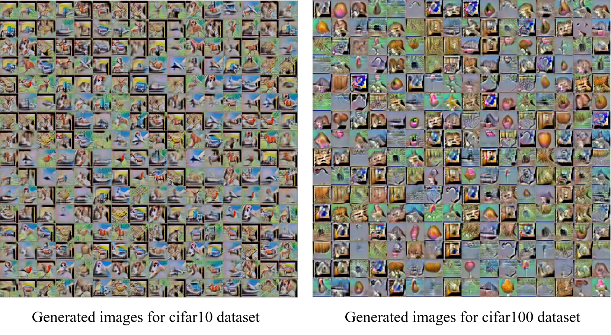
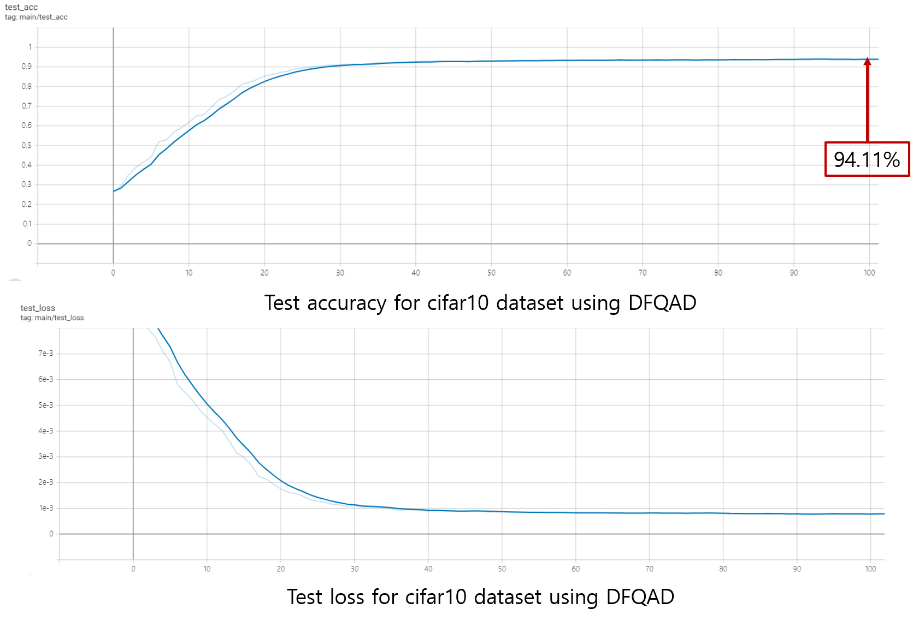

# Data-Free Network Quantization With Adversarial Knowledge Distillation

Data-Free Network Quantization With Adversarial Knowledge Distillation PyTorch (Reproduced)
## Requirements

- Pytorch 1.4.0 
- Python 3.6
- Torchvision 0.5.0
- tensorboard
- tensorboardX


## Running the code

### cifar10 dataset 

```shell
CUDA_VISIBLE_DEVICES=0 python main.py --dataset=cifar10 --alpha=0.01 --do_warmup=True --do_Ttrain=True
```

The generated images and a trained student network from Knowledge distillation will be saved in `./outputs` (default) folder.

### cifar100 dataset 

if you did train the teacher network, let argument "do_Ttrain" be False like as belows:

```shell
CUDA_VISIBLE_DEVICES=0 python main.py --dataset=cifar10 --alpha=0.01 --do_warmup=True --do_Ttrain=False
```


Arguments:

- `dataset` - Choose a dataset name
	- [cifar10, cifar100]
- `data` - dataset path
- `teacher_dir` - save path for teacher 
- `n_epochs` - Epochs
- `iter` - Iterations
- `batch_size` - Size of the batches
- `lr_G` - learning rate for generator
- `lr_S` - learning rate for student
- `alpha` - Alpha value
- `latent_dim` - Dimensionality of the latent space
- `img_size` - Size of each image dimension
- `channels` - Number of image channels
- `saved_img_path` - Save path for generated images
- `saved_model_path` - Save path for trained stduent
- `do_warmup` - Do warm-up??
- `do_Ttrain` - Do train teacher network??


## Result examples






### <span style="color:#C70039 ">Reference </span>
Choi, Yoojin, et al. "Data-free network quantization with adversarial knowledge distillation." Proceedings of the IEEE/CVF Conference on Computer Vision and Pattern Recognition Workshops. 2020.

